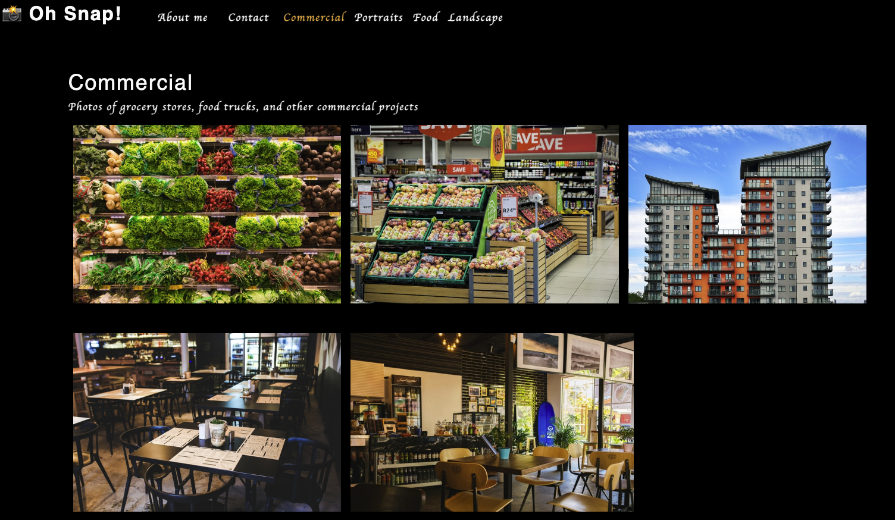

# Photo Port - 

**Single page application built in React showcasing a personal photography portfolio.**

_Languages Used: React.js, CSS3, Javascript, ReactDOM_

## Table of Contents:

1. [Installation Instructions](#installation-instructions)
2. [Usage instructions](#usage-instructions)
3. [Contributor Guidelines](#contributor-guidelines)
4. [Testing instructions](#testing-instructions)
5. [Questions / Contact Information](#questions)
6. [Walkthrough Video / Screenshots](#walkthrough)

### Installation Instructions:

Clone the repository from Github and type "npm i" in the CLI to install the dependencies.

### Usage Instructions:

Type "npm start" in the CLI to open the app in the browser

### Contributor Guidelines:

Push to Github for review!

### Testing Instructions:

N/A

### Questions?

<aofish815@gmail.com>

Check out my **[Github](https://github.com/superfishal/photo-port)**

### Walkthrough

